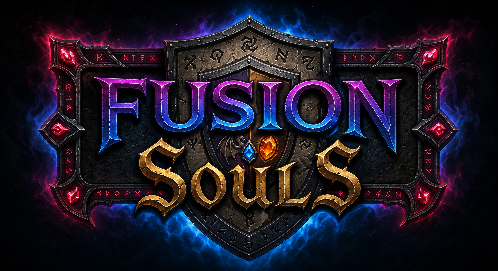

# ◈ Fusion Souls ◈
# 

> No mundo, almas não desaparecem quando alguém morre; elas vagam e procuram receptáculos. O protagonista, sendo um humano comum, possui uma maldição: o poder de absorver e fundir  almas dentro de si.
#

# 🧬 Lista de Classes / Souls
>Humano: A classe inicial comum do jogador antes de começar a absorver as almas.

- ## Berzerker💪:
 Humano musculoso de aproximadamente 2 metros de altura, especialista em força bruta e armas pesadas no combate mano a mano.

- ## Dracconico🐲:
 Um Ser híbrido de dragão e demônio. Possui asas para locomoção rápida (voo/esquiva) e usa poderes de fogo como bolas e tiros de chamas.

- ## Zexcromante👻: 
Um ser meio caveira capaz de invocar espíritos guerreiros que lutam utilizando espadas.

- ## SniperVision👁:
 Mestre do combate de longo alcance, utilizando rifles de precisão (snipers) e arcos com flechas.

- ## Chronoguard⚙:
 Guardião que usa poderes dourados de engrenagens para manipular o tempo. Possui a esquiva Dobra Temporal (invulnerabilidade curta) e cartas para rebobinar a própria vida e criar campos de lentidão.

- ## Toxishaman🐍:
 Xamã da natureza degradada que se transforma em nuvem de esporos ao desviar. Usa cartas para prender inimigos em vinhas e aplicar dano contínuo de envenenamento (miasma).

- ## Aegisknight🛡:
 Cavaleiro de suporte com escudos colossais e armadura de aço. Usa a locomoção Carga Impenetrável para atropelar inimigos, além de erguer barreiras contra projéteis e causar ondas de choque magnéticas.
